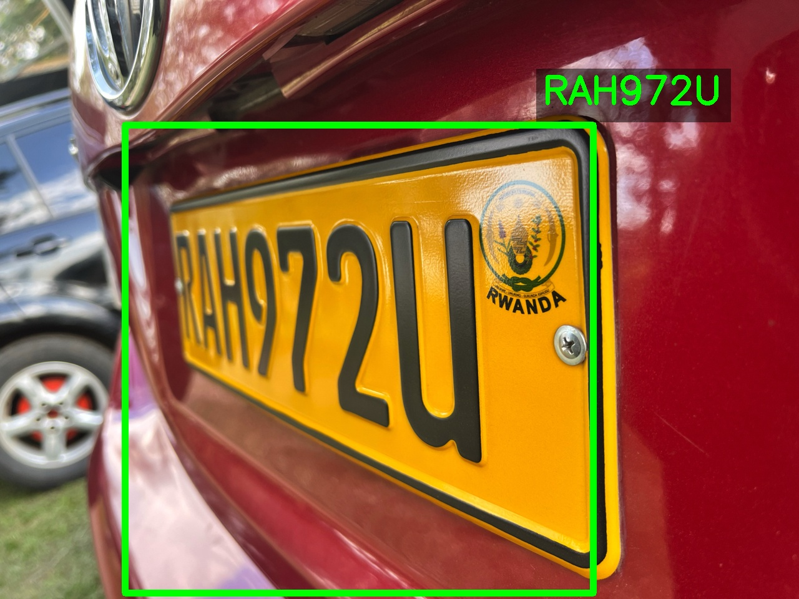

# OpenCV Assignment 1: Automatic Number Plate Recognition (ANPR) System

This project implements a simple Automatic Number Plate Recognition (ANPR) system using OpenCV. The system detects and reads license plates from input images.

## Table of Contents

- [Introduction](#introduction)
- [Installation](#installation)
- [Usage](#usage)
- [Features](#features)
- [Dependencies](#dependencies)
- [Configuration](#configuration)
- [Documentation](#documentation)
- [Examples](#examples)
- [Troubleshooting](#troubleshooting)

## Introduction

The ANPR system processes input images to detect license plates and extract their alphanumeric content. This project demonstrates the use of OpenCV for image processing tasks related to license plate recognition.

## Installation

1. **Clone the repository:**

   ```bash
   git clone https://github.com/RUKUNDO-Prince/opencv-assignment-1.git
   cd opencv-assignment-1
   ```

2. **Create and activate a virtual environment (optional but recommended):**

   ```bash
   python -m venv venv
   source venv/bin/activate  # On Windows: venv\Scripts\activate
   ```

3. **Install the required dependencies:**

   ```bash
   pip install -r requirements.txt
   ```

   *Note: If `requirements.txt` is not present, install OpenCV directly:*

   ```bash
   pip install opencv-python
   ```

## Usage

1. **Run the ANPR script:**

   ```bash
   python anpr.py
   ```

2. **Input Image:**

   Ensure that the image you want to process is named `assignment-001-given.jpg` and is located in the project directory. You can modify the script to process different images as needed.

3. **Output:**

   The processed image with the detected license plate will be saved as `assignment-001-result.jpg` in the project directory.

## Features

- License plate detection in input images.
- Extraction and display of license plate regions.

## Dependencies

- Python 3.x
- OpenCV

*Additional dependencies can be listed in the `requirements.txt` file.*

## Configuration

Currently, the script processes a predefined image file. To configure the system for different images or to adjust processing parameters, modify the `anpr.py` script accordingly.

## Documentation

For detailed information on how the ANPR system works and the algorithms used, please refer to the comments within the `anpr.py` script.

## Examples

**Input Image:**


**Output Image:**



## Troubleshooting

- **Issue:** No module named 'cv2'.
  - **Solution:** Ensure that OpenCV is installed:

    ```bash
    pip install opencv-python
    ```

- **Issue:** The script runs but does not detect any license plates.
  - **Solution:** Verify that the input image is clear and contains a visible license plate. Adjust the image preprocessing parameters in the script if necessary.
